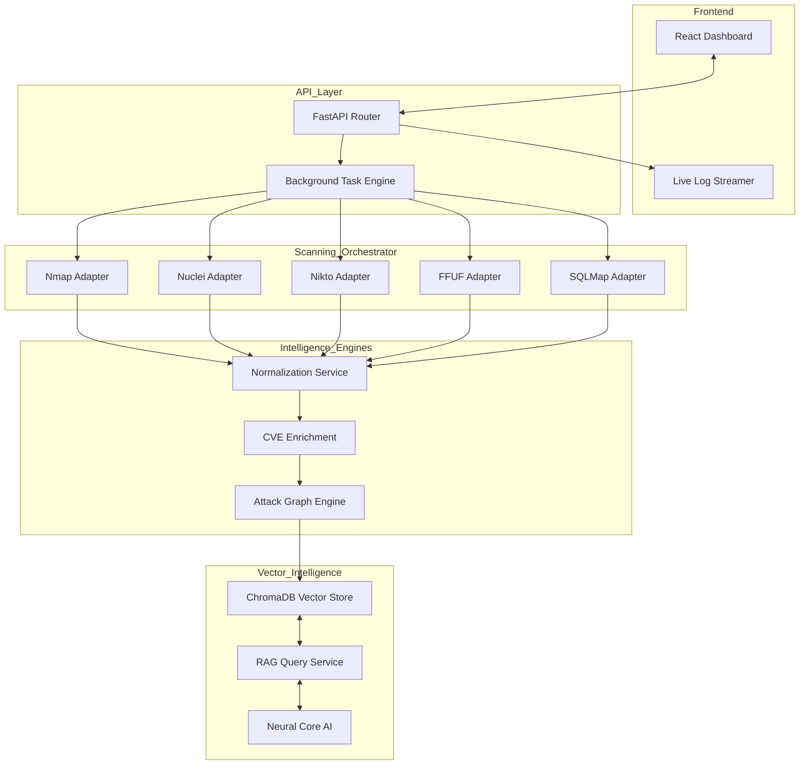

<p align="center">
  
</p>

# 🦅 VulnSight: Intelligent Cybersecurity Intelligence Platform

[](https://www.python.org/)
[](https://nodejs.org/)
[](https://opensource.org/licenses/MIT)
[](https://github.com/Dharanish-AM/VulnSight)

**VulnSight** is a production-grade, modular vulnerability management system. It orchestrates industry-standard scanning tools, normalizes disparate security data, predicts sophisticated attack paths, and provides a RAG-powered AI interface for real-time security intelligence.

---

## 🚀 Core Capabilities

- **Unified Scanning Pipeline**: Native integration with `Nmap`, `Nuclei`, `Nikto`, `SQLMap`, and `FFUF` via pluggable adapters.
- **Intelligent Normalization**: Deduplicates findings across tools and standardizes them into a high-fidelity schema.
- **Threat Enrichment**: Injects live CVE data, CVSS scoring, and detailed remediation guidance.
- **Attack Graph Engine**: Uses NetworkX to model infrastructure dependencies and predict potential lateral movement paths.
- **"Neural Core" RAG Interface**: A scan-aware AI system that uses **ChromaDB** to provide context-specific security advice.
- **Cyber-Tactical Dashboard**: A modern React-based interface with real-time telemetry, live SSE log streaming, and advanced data visualization.

---

## 🏗 System Architecture



---

## 📁 Project Structure

```text
VulnSight/
├── backend/
│   ├── app/
│   │   ├── api/             # FastAPI Endpoint Routers
│   │   ├── scanners/        # Tool-specific adapter logic (Nmap, Nikto, SSE, etc.)
│   │   ├── services/        # Logic for normalization and enrichment
│   │   ├── attack_graph/    # NetworkX-based path prediction
│   │   ├── rag/             # Vector DB and RAG pipeline
│   │   └── data/            # Local scan state, logs, and reports
│   ├── main.py              # Application Entry Point
│   └── requirements.txt     # Python Dependencies
├── frontend/
│   ├── src/                 # React Application (Vite-powered)
│   │   ├── App.jsx          # Main UI Orchestrator
│   │   └── index.css        # Premium Dark-Mode Styles
│   └── package.json         # Node Dependencies
└── scripts/
    ├── start_backend.sh     # Automation script for Backend
    └── start_frontend.sh    # Automation script for Frontend
```

---

## 🛠 Installation & Setup

### Prerequisites (macOS)

Ensure you have the core scanning tools installed. You can install them using [Homebrew](https://brew.sh/):

```bash
brew install nmap nuclei nikto sqlmap ffuf
```

> [!NOTE]
> If tools are missing, the system will gracefully switch to safe mock-telemetry to allow UI and Intelligence engine testing.

### 1. Backend Environment

```bash
cd backend
python3 -m venv venv
source venv/bin/activate
pip install -r requirements.txt
python main.py
```

### 2. Frontend Environment

```bash
cd frontend
npm install
npm run dev
```

---

## ⚡ Troubleshooting & Compatibility

### 🧠 ChromaDB & Python 3.14+

If you are running **Python 3.14+**, you may encounter a `ConfigError` related to ChromaDB's dependencies. VulnSight includes an **Intelligent Fallback Layer**:

- If `chromadb` fails to initialize, the system automatically enables an **In-Memory Search Service**.
- This ensures the "Neural Core" chatbot remains functional even without a native vector store.

### 📦 Missing Dependencies

If you encounter `ModuleNotFoundError: No module named 'networkx'`, ensure your virtual environment is activated:

```bash
source venv/bin/activate
pip install -r requirements.txt
```

---

## 🧪 Advanced Testing

We provide a specialized script to test the entire lifecycle (Scan → Normalize → Attack Path → RAG Query):

```bash
cd backend
python test_e2e.py
```

This script will:
1. Trigger a live scan.
2. Poll until results are enriched.
3. Validate attack chain generation.
4. Execute a successful RAG query against the "Neural Core".

---

## 🔒 Security

- **Strict Input Validation**: Sanity checks on all target IP/Domain strings.
- **Process Isolation**: Scanners run in isolated subprocesses with restricted shell execution.
- **No Hardcoded Secrets**: All configurations are modularized and environment-driven.

---

<p align="center">
  Built with ❤️ by the VulnSight Team
</p>
