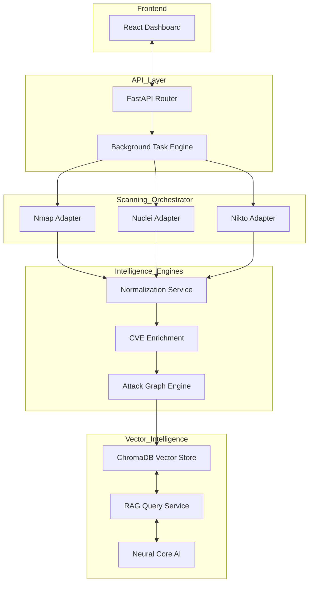

# 🦅 VulnSight: Intelligent Cybersecurity Intelligence Platform

VulnSight is a production-grade, modular vulnerability management system. It orchestrates industry-standard scanning tools, normalizes disparate security data, predicts sophisticated attack paths, and provides a RAG-powered AI interface for real-time security intelligence.

---

## 🚀 Core Capabilities

- **Unified Scanning Pipeline**: Native integration with Nmap, Nuclei, and Nikto via pluggable adapters.
- **Intelligent Normalization**: Deduplicates findings across tools and standardizes them into a high-fidelity schema.
- **Threat Enrichment**: Injects live CVE data, CVSS scoring, and detailed remediation guidance.
- **Attack Graph Engine**: Uses NetworkX to model infrastructure dependencies and predict potential lateral movement paths.
- **"Neural Core" RAG Interface**: A scan-aware AI system that uses a vector database (ChromaDB) to provide context-specific security advice.
- **Cyber-Tactical Dashboard**: A modern React-based interface with real-time telemetry and advanced visualization.

---

## 🏗 System Architecture



---

## 📁 Project Structure

```text
VulnSight/
├── backend/
│   ├── app/
│   │   ├── api/             # FastAPI Endpoint Routers
│   │   ├── scanners/        # Tool-specific adapter logic
│   │   ├── services/        # Logic for normalization and enrichment
│   │   ├── attack_graph/    # NetworkX-based path prediction
│   │   ├── rag/             # Vector DB and RAG pipeline
│   │   └── data/            # Local scan state and reports
│   ├── main.py              # Application Entry Point
│   ├── requirements.txt     # Python Dependencies
│   └── test_e2e.py          # End-to-End lifecycle test script
├── frontend/
│   ├── src/                 # React Application Source
│   └── package.json         # Node Dependencies
└── scripts/
    ├── start_backend.sh     # Automation script for Backend
    └── start_frontend.sh    # Automation script for Frontend
```

---

## 🛠 Installation & Setup

### Prerequisites

- **Python 3.11+**
- **Node.js (v18+)**
- **Scanning Tools** (Installed and in your PATH):
  - `nmap`, `nuclei`, `nikto`
  - *Note: If tools are missing, the system will gracefully switch to safe mock-telemetry.*

### 1. Backend Environment

```bash
cd backend
python3 -m venv venv
source venv/bin/activate
pip install -r requirements.txt
python main.py
```

### 2. Frontend Environment

```bash
cd frontend
npm install
npm run dev
```

---

## ⚡ Troubleshooting & Python 3.14 Compatibility

### 🧠 ChromaDB Fallback

If you are running **Python 3.14+**, you may encounter a `ConfigError` related to ChromaDB's Pydantic V1 dependencies. 

VulnSight includes an **Intelligent Fallback Layer**:
- If `chromadb` fails to initialize, the system automatically enables an **In-Memory Search Service**.
- This ensures the "Neural Core" chatbot remains functional even without a native vector store.

### 📦 Missing Dependencies

If you encounter `ModuleNotFoundError: No module named 'networkx'`, ensure your virtual environment is activated:

```bash
source venv/bin/activate
pip install -r requirements.txt
```

---

## 🧪 Advanced Testing

### Local Test Target Server

VulnSight now includes a local, intentionally insecure target server for scanner validation.

```bash
./scripts/start_test_server.sh
```

Recommended targets to enter in the UI:

- `http://127.0.0.1:8081` (general web checks, ffuf/nikto/nuclei)
- `http://127.0.0.1:8081/product?id=1` (SQLMap-oriented)

Detailed notes: `test_target/README.md`

We provide a specialized script to test the entire lifecycle (Scan → Normalize → Attack Path → RAG Query):

```bash
cd backend
python test_e2e.py
```

This script will:

1. Trigger a live scan.
2. Poll until results are enriched.
3. Validate attack chain generation.
4. Execute a successful RAG query against the "Neural Core".

---

## 🔒 Security

- **Strict Input Validation**: Sanity checks on all target IP/Domain strings.
- **Process Isolation**: Scanners run in isolated subprocesses with restricted shell execution.
- **No Hardcoded Secrets**: All configurations are modularized.

